# Recommendation Service High-Level Flow

## Purpose

`recommendation-service` builds recommendation payloads for customers in two modes:

1. Pull mode via REST (`/api/recommendations/{customerId}`)
2. Push mode via Server-Sent Events (`/api/recommendations/{customerId}/stream`)

It consumes upstream domain events from Kafka topics (through Spring Cloud Stream), updates its local read model, and publishes in-memory internal events to drive real-time recommendation updates.

---

## Main Building Blocks

- **Message Consumers**
  - `genreUpdatedEventConsumer`
  - `movieAddedEventConsumer`
  - Declared in `EventConsumerConfig`
  - Bound via `application.yaml` to:
    - `customer-events`
    - `movie-events`

- **Write-side Services (local read-model updates)**
  - `CustomerService` updates `customer_genre`
  - `MovieService` updates `movie`

- **Read-side Recommendation Service**
  - `RecommendationService` reads from `movie` table and maps to DTOs:
    - Newly added movies
    - Personalized movies by favorite genre

- **Reactive Stream Notifier**
  - `RecommendationStreamService`
  - Maintains `Sinks.Many<MovieRecommendations>`
  - Emits new recommendation packets when internal app events are published

- **HTTP Layer**
  - `RecommendationController`
  - Exposes:
    - Snapshot endpoint (`GET /api/recommendations/{customerId}`)
    - Live endpoint (`GET /api/recommendations/{customerId}/stream`)

---

## Data Model and Query Intent

- `movie` table
  - Stores movie metadata and genre array
  - Used for both newly added and personalized recommendation queries
  - `created_at` enables newest-first sorting

- `customer_genre` table
  - One row per customer (`customer_id`)
  - Stores `favorite_genre`

- Personalized query strategy
  - Join `movie` with `customer_genre` by `customerId`
  - Filter movies where `favorite_genre` is contained in movie `genres`
  - Sort by `vote_count` (descending), limit 10

---

## End-to-End Flow A: Movie Added Event

1. Upstream producer publishes `MovieAddedEvent` to `movie-events`.
2. Spring Cloud Stream routes message to `movieAddedEventConsumer`.
3. Consumer delegates to `MovieService.addMovie(...)`.
4. `MovieService` maps event to `Movie` entity and saves to `movie` table.
5. `MovieService` publishes internal app event: `RecommendationEvents.NewMovieEvent(movieId)`.
6. `RecommendationStreamService.onMovieAdded(...)` handles it asynchronously.
7. Service fetches the saved movie via `RecommendationService.findMovie(movieId)`.
8. Builds payload: `MovieRecommendations.newlyAdded([movie])`.
9. Emits payload into Reactor sink (`Sinks.Many`).
10. SSE subscribers receive the emitted item:
    - Global newly-added updates are not customer-specific (`customerId = null`).

Result:
- Snapshot endpoint starts including this movie based on `created_at` ordering.
- Live stream subscribers get immediate newly-added push update.

---

## End-to-End Flow B: Customer Genre Updated Event

1. Upstream producer publishes `CustomerGenreUpdatedEvent` to `customer-events`.
2. Spring Cloud Stream routes message to `genreUpdatedEventConsumer`.
3. Consumer delegates to `CustomerService.updateGenre(...)`.
4. `CustomerService` upserts customer preference into `customer_genre`.
5. `CustomerService` publishes internal app event: `RecommendationEvents.PersonalizedEvent(customerId)`.
6. `RecommendationStreamService.onPersonalized(...)` handles it asynchronously.
7. Service computes `findPersonalized(customerId)` from DB.
8. Builds payload: `MovieRecommendations.personalized(customerId, movies)`.
9. Emits payload into Reactor sink.
10. SSE stream is filtered by customer:
    - Only subscribers for matching `customerId` receive this personalized update.

Result:
- Snapshot endpoint returns updated personalized recommendations for that customer.
- Live stream for that customer receives immediate refresh.

---

## End-to-End Flow C: HTTP Snapshot Request

1. Client calls `GET /api/recommendations/{customerId}`.
2. Controller fetches:
   - `findNewlyAdded()` (top latest movies)
   - `findPersonalized(customerId)` (genre match ranked by vote count)
3. Controller returns a list with two typed recommendation blocks:
   - `NEWLY_ADDED`
   - `PERSONALIZED`

This is synchronous, request-response retrieval from current DB state.

---

## End-to-End Flow D: HTTP Live Stream Request (SSE)

1. Client calls `GET /api/recommendations/{customerId}/stream`.
2. Controller returns Flux from `RecommendationStreamService.streamRecommendations(customerId)`.
3. Stream subscribes to shared sink-backed flux.
4. Filter rule:
   - Emit if `rec.customerId == null` (global updates like newly added)
   - Emit if `rec.customerId == requestedCustomerId` (personalized updates)
5. As Kafka events arrive and internal handlers emit, client receives incremental updates in real time.

---

## Internal Eventing Design (Why Two-Step Event Handling)

The service intentionally separates:

1. **External message consumption** (Kafka -> service write model)
2. **Internal recommendation notification** (ApplicationEvent -> reactive sink)

Benefits:
- Keeps consumer logic simple and focused on persistence.
- Decouples DB update path from UI push path.
- Allows different internal listeners to react without changing consumer contracts.
- Supports async stream emission (`@Async`) without blocking message handling.

---

## Consistency and Timing Characteristics

- Snapshot endpoint reflects persisted DB state at request time.
- SSE events are near-real-time and emitted after internal event handlers compute payloads.
- Because stream emission is async, ordering across different event types is eventually consistent, not strictly transactional across all subscribers.

---

## Runtime Summary

- **Input:** Kafka domain events (`movie-events`, `customer-events`)
- **State:** Local read-model tables (`movie`, `customer_genre`)
- **Output (pull):** REST recommendation snapshots
- **Output (push):** SSE recommendation updates from Reactor sink

The service behaves as a read-model + notifier component in an event-driven architecture.

---

## Class/Function Flow Graphs

### 1) Movie Added Event -> DB -> Stream

```mermaid
flowchart LR
    A[Kafka Topic: movie-events] --> B[EventConsumerConfig.movieAddedEventConsumer]
    B --> C[MovieService.addMovie]
    C --> D[RecommendationMapper.toMovie]
    D --> E[MovieRepository.save]
    E --> F[ApplicationEventPublisher.publishEvent NewMovieEvent]
    F --> G[RecommendationStreamService.onMovieAdded @Async @EventListener]
    G --> H[RecommendationService.findMovie]
    H --> I[MovieRepository.findById]
    I --> J[RecommendationMapper.toMovieSummary]
    J --> K[MovieRecommendations.newlyAdded]
    K --> L[recommendationSink.emitNext]
    L --> M[RecommendationStreamService.streamRecommendations filter]
    M --> N[GET /api/recommendations/{customerId}/stream subscribers]
```

### 2) Customer Genre Updated Event -> DB -> Personalized Stream

```mermaid
flowchart LR
    A[Kafka Topic: customer-events] --> B[EventConsumerConfig.genreUpdatedEventConsumer]
    B --> C[CustomerService.updateGenre]
    C --> D[RecommendationMapper.toCustomerGenre]
    D --> E[CustomerGenreRepository.save]
    E --> F[ApplicationEventPublisher.publishEvent PersonalizedEvent]
    F --> G[RecommendationStreamService.onPersonalized @Async @EventListener]
    G --> H[RecommendationService.findPersonalized]
    H --> I[MovieRepository.findPersonalized]
    I --> J[RecommendationMapper.toMovieSummary for each movie]
    J --> K[MovieRecommendations.personalized]
    K --> L[recommendationSink.emitNext]
    L --> M[RecommendationStreamService.streamRecommendations filter by customerId]
    M --> N[Matching /stream subscriber receives event]
```



### 3) Snapshot REST Call (Pull)

```mermaid
flowchart LR
    A[Client GET /api/recommendations/{customerId}] --> B[RecommendationController.getRecommendations]
    B --> C[RecommendationService.findNewlyAdded]
    C --> D[MovieRepository.findTop10ByOrderByCreatedAtDesc]
    B --> E[RecommendationService.findPersonalized]
    E --> F[MovieRepository.findPersonalized]
    D --> G[RecommendationMapper.toMovieSummary]
    F --> H[RecommendationMapper.toMovieSummary]
    G --> I[MovieRecommendations.newlyAdded]
    H --> J[MovieRecommendations.personalized]
    I --> K[HTTP response list]
    J --> K
```

### 4) SSE Subscription Path (Push)

```mermaid
flowchart LR
    A[Client GET /api/recommendations/{customerId}/stream] --> B[RecommendationController.getRecommendationStream]
    B --> C[RecommendationStreamService.streamRecommendations]
    C --> D[recommendationSink.asFlux]
    D --> E{Filter rule}
    E -->|rec.customerId == null| F[Emit global newly-added update]
    E -->|rec.customerId == requested id| G[Emit personalized update]
```

### 5) One-Line Mental Model

```mermaid
flowchart LR
    A[External Events] --> B[Consumers]
    B --> C[MovieService / CustomerService]
    C --> D[(DB read-model)]
    C --> E[Internal App Events]
    E --> F[RecommendationStreamService]
    D --> F
    D --> G[RecommendationService for REST]
    F --> H[SSE /stream]
    G --> I[REST /api/recommendations/{customerId}]
```
