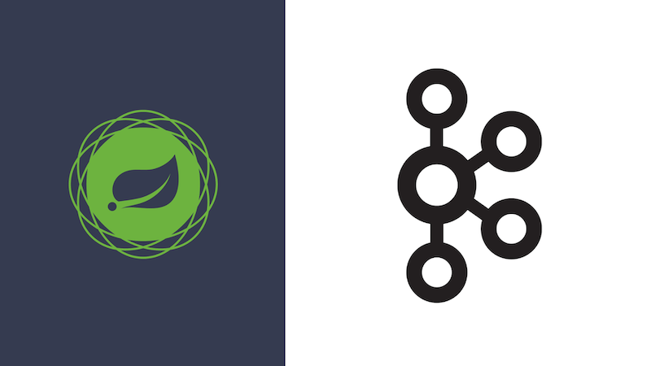

## Modern Event-Driven Spring Boot: Apache Kafka & Spring Cloud Stream

This repoistory contains the source code for [**my course**](https://www.udemy.com/course/kafka-java/?referralCode=2C54F3F53BF76F1FF450) on Udemy.

## Course Highlights:

### Kafka Fundamentals

* Producers and Consumers
* Topics, Partitions, Offsets
* Consumer Groups and Rebalancing
* Message Ordering and Keys
* CLI examples and configurations

### Spring Cloud Stream Applications

* Consumer, Producer, and Processor services
* Reactive and imperative implementations
* Event routing patterns
* Dynamic message production (StreamBridge)

### Advanced Kafka Patterns

* Scaling with consumer groups
* Parallel and batch processing
* Message acknowledgement strategies
* Error handling, retries, DLQ
* Transactions and exactly-once concepts

### Testing & Security

* Integration testing with TestBinder and Testcontainers
* Serialization testing scenarios
* Kafka security using SASL / SSL

### Final Project — Netflux

A production-style event-driven microservices system demonstrating real-time communication using Kafka.